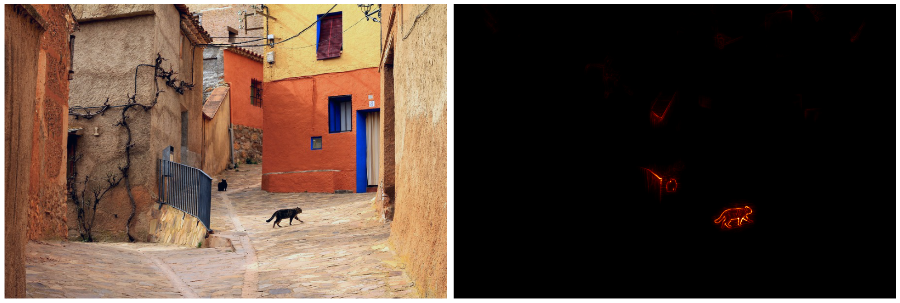
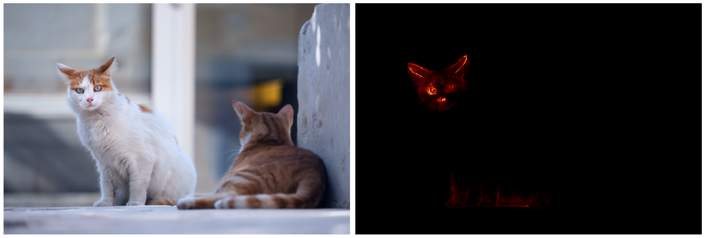
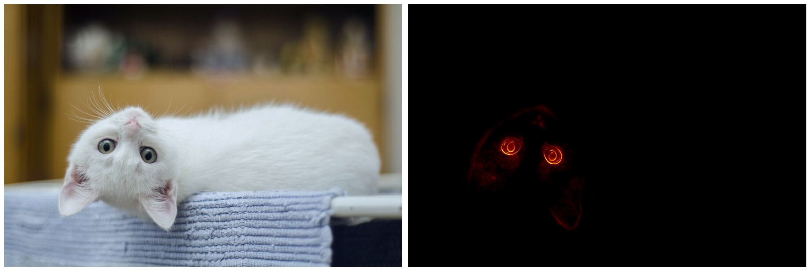
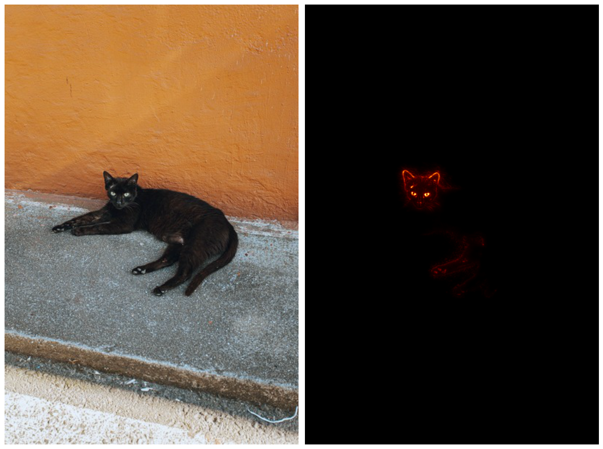
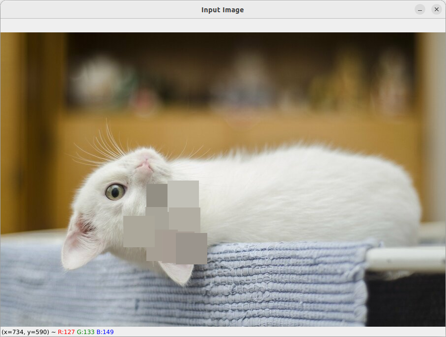
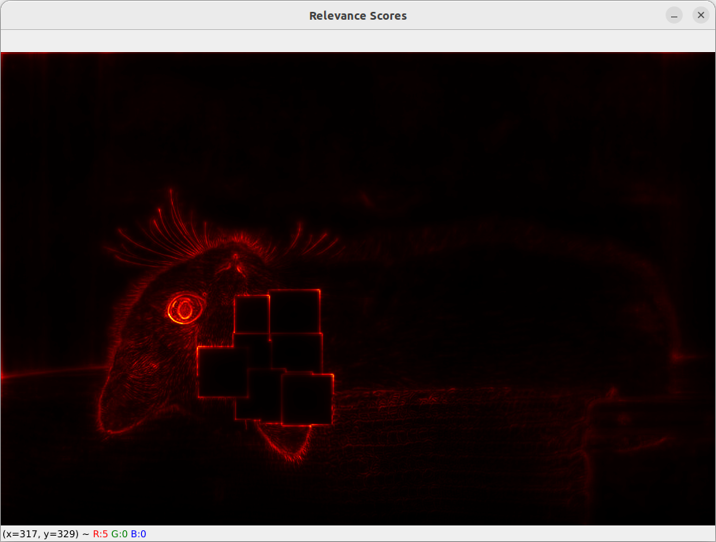
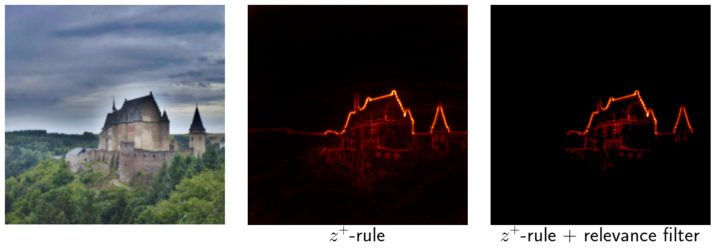
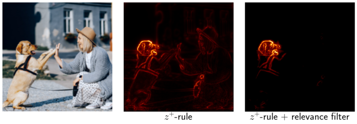

# Layer-wise Relevance Propagation (LRP) in PyTorch

Basic unsupervised implementation of Layer-wise Relevance Propagation ([Bach et al.][bach2015], 
[Montavon et al.][montavon2019]) in PyTorch for VGG networks from PyTorch's Model Zoo. 
[This][montavon_gitlab] tutorial served as a starting point. 
In this implementation, I tried to make sure that the code is easy to understand and easy to extend to other 
network architectures.

I also added a novel relevance propagation filter to this implementation resulting in much crisper heatmaps 
(see my [blog][blog] for more information). 
If you want to use it, please don't forget to cite this implementation.

This implementation is already reasonably fast. 
It is therefore also suitable for projects that want to use LRP in real time.
Using a RTX 2080 Ti graphics card I reach 53 FPS with the VGG-16 network.

If I find the time, I will provide a more model agnostic implementation. 
I also welcome pull requests improving this implementation.

You can find more information about this implementation on my [blog](https://kaifishr.github.io/).

## Executive Summary

Running LRP for a PyTorch VGG network is fairly straightforward

```python
import torch
from torchvision.models import vgg16, VGG16_Weights
from src.lrp import LRPModel

x = torch.rand(size=(1, 3, 224, 224))
model = vgg16(weights=VGG16_Weights.DEFAULT)
lrp_model = LRPModel(model)
r = lrp_model.forward(x)
```

## Example LRP Projects

Currently there are three minimal LRP projects. These projects can be executed with the following commands:

```bash
python -m projects.per_image_lrp.main
python -m projects.real_time_lrp.main
python -m projects.interactive_lrp.main
```

### Per-image LRP

Per-image LRP applies Layer-wise relevance propagation to all images located in the *input* folder. With this option high resolution relevance heatmaps can be created.

|||
|:---:|:---:|
|||
|||
|||
|||

### Real-time LRP

Real-time LRP lets you use your webcam to create a heatmap video stream. The example below shows images filmed from a monitor.

<p align="center">
    
</p>

### Interactive LRP

Interactive LRP allows you to manipulate the input space with different kind of patches. This option is interesting to see how the network reacts to changes in the image input space.

| Input | Relevance Scores |
|:---:|:---:|
|||


## Relevance Filter

This implementation comes with a novel relevance filter for much crisper heatmaps. Examples show the $z^+$-rule without and with additional relevance filter.

| | |
|:---:|:---:|
|||
|||

## TODOs

- Add support for other network architectures (model agnostic)

## License

MIT

## Citation

```bibtex
@misc{blogpost,
  title={Layer-wise Relevance Propagation for PyTorch},
  author={Fischer, Kai},
  howpublished={\url{https://github.com/kaifishr/PyTorchRelevancePropagation}},
  year={2021}
}
```

## References

[[1]: On Pixel-Wise Explanations for Non-Linear Classifier Decisions by Layer-Wise Relevance Propagation][bach2015]

[[2]: Layer-Wise Relevance Propagation: An Overview][montavon2019]

[[3]: LRP tutorial][montavon_gitlab]

[bach2015]: https://journals.plos.org/plosone/article?id=10.1371/journal.pone.0130140
[montavon2019]: https://link.springer.com/chapter/10.1007%2F978-3-030-28954-6_10
[montavon_gitlab]: https://git.tu-berlin.de/gmontavon/lrp-tutorial
[blog]: https://kaifabi.github.io
